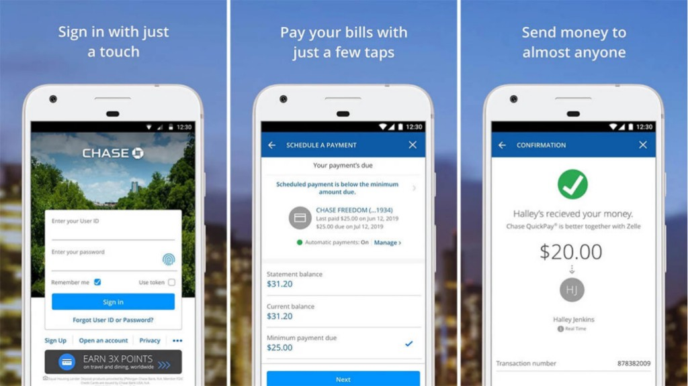

# Departemen Litbang Bidang Developer

## Task
Buatlah project dengan memilih minimal salah satu BAGIAN/STACK berikut :
- Back-end web service
- Front-end website
- Front-end mobile apps

TEMA dari project wajib memilih salah satu dari:
- Manajemen Surat Menyurat
- Manajemen Keuangan
- Manajemen Anggota Organisasi

Ketentuan :
- Dikerjakan secara individu. 
- Fitur-fitur yang dibuat bebas dan sesuai kreativitas dengan syarat harus sesuai tema yang dipilih.
- Bahasa pemrograman yang digunakan bebas
- Mematuhi aturan lisensi apabila menggunakan kode sumber eksternal
- Bebas menggunakan framework/library
- Disarankan mengaplikasikan Test Driven Development

Pengumpulan : 
- Project diupload ke github/gitlab dengan repository public dan dipresentasikan saat tes wawancara
- Pengumpulan melalui email dengan ketentuan,
  - Kirim ke email poros di ubporos@gmail.com
  - Kirim dengan Subjek `[ FREEPASS POROS DEV 2021 ]`
  - Lampirkan nama, nim, id line, beserta tatutan ke github repository

---

Contoh Back-end web service

Contoh Front-end website

Contoh Front-end mobile apps

